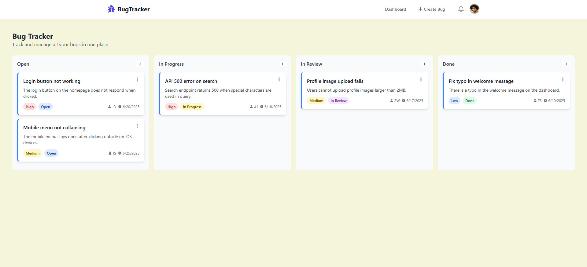
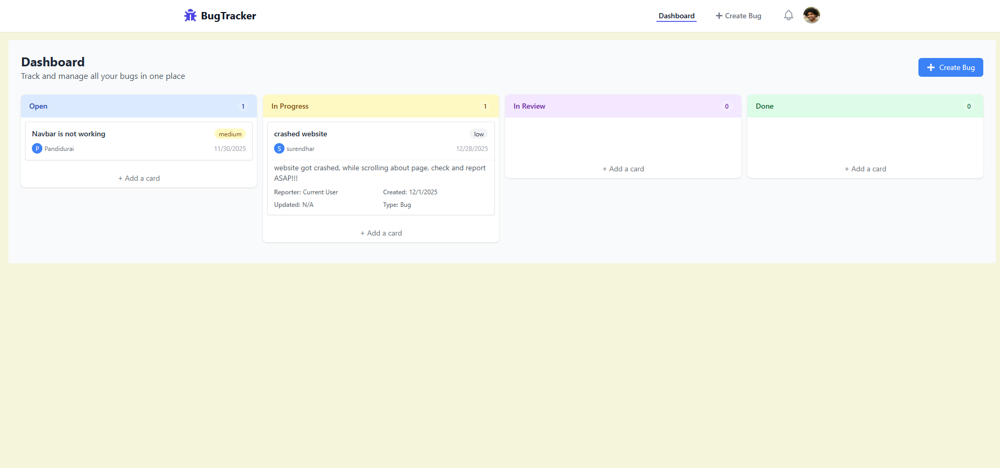

🐞 Bug Tracker – Full-Stack Application

A full-stack Bug Tracking system built for software teams to log, track, prioritize, and resolve bugs efficiently.
This project demonstrates real-world software engineering skills including authentication, role-based access, REST API development, database modeling, reusable UI components, and clean folder architecture.

Features
Authentication & Authorization

User registration & login

JWT-based authentication

Role-based access (Admin / Developer / Tester)

🪲 Bug Management

Create, view, update, and delete bugs

Assign bugs to team members

Set severity levels (Low, Medium, High, Critical)

Set status (Open, In-Progress, Resolved, Closed)

🏷 Project Management

Create & manage multiple projects

Each bug is linked to a specific project

👤 User Management (Admin Only)

Add users

Change roles

Manage permissions

📊 Dashboard & Statistics

Total bugs

Bugs per project

Bugs per priority

Bugs per status

🌐 Modern UI

Built with React

Responsive design

Reusable components

Toast notifications for user actions

⚙️ Backend API

RESTful API built with Node.js + Express

Error-handling middleware

MongoDB data models with Mongoose

🛠️ Tech Stack
Frontend

React.js

React Router

Axios

Tailwind / Bootstrap (pick yours)

Backend

Node.js

Express.js

MongoDB (Mongoose)

JSON Web Tokens (JWT)

bcrypt

📁 Folder Structure

bug-tracker/
 ├── client/                 # React Frontend
 │   ├── src/
 │   │   ├── components/
 │   │   ├── pages/
 │   │   ├── context/
 │   │   └── utils/
 │   └── package.json
 │
 └── backend/                # java Backend
     ├── controllers/
     ├── models/
     ├── routes/
     ├── middleware/
     ├── config/
     └── server.js

🧩 API Endpoints
Auth

| Method | Endpoint             | Description       |
| ------ | -------------------- | ----------------- |
| POST   | `/api/auth/register` | Register new user |
| POST   | `/api/auth/login`    | Login user        |

Bugs

| Method | Endpoint        | Description  |
| ------ | --------------- | ------------ |
| GET    | `/api/bugs`     | Get all bugs |
| POST   | `/api/bugs`     | Create bug   |
| PUT    | `/api/bugs/:id` | Update bug   |
| DELETE | `/api/bugs/:id` | Delete bug   |

Projects

| Method | Endpoint        | Description  |
| ------ | --------------- | ------------ |
| GET    | `/api/projects` | Get all projects |
| POST   | `/api/projects` | Create project |
| PUT    | `/api/projects/:id` | Update project |
| DELETE | `/api/projects/:id` | Delete project |

1️⃣ Clone the repo
git clone https://github.com/yourusername/bug-tracker.git
cd bug-tracker

2️⃣ Install dependencies
npm install

3️⃣ Run the app
npm run dev

4️⃣ Open http://localhost:3000 in your browser

backend

1️⃣ Clone the repo
https://github.com/yourusername/bug-tracker.git
mvnw clean install

2️⃣ Run the app
mvnw spring-boot:run

3️⃣ Open http://localhost:8080 in your browser

Screenshots for reference 

1.Home Page 

2.Dashboard Page

3.Create Bug Page
.png)

4.AI Create Bug Page 
.png)

📝 Future Enhancements

Real-time notifications (Socket.io)

Email alerts

Sprint management

Activity logs

Role-based UI rendering

👨‍💻 Author

Pandidurai S
Full-Stack Software Engineer (1.5+ years experience)
Specializing in React, Node.js, and AI-integrated applications.