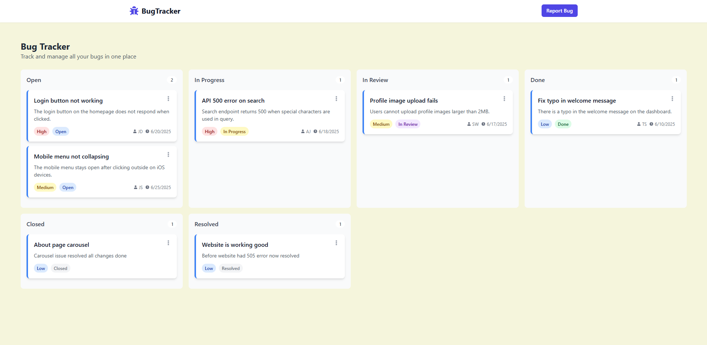
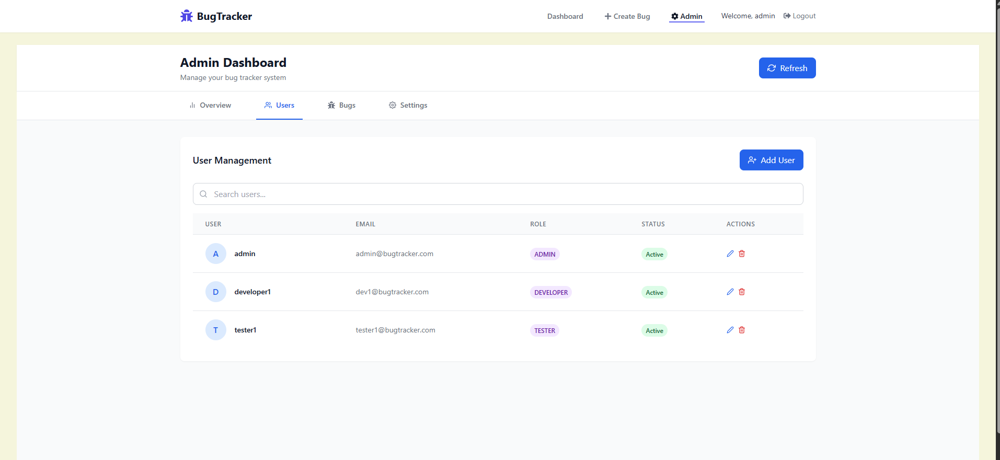
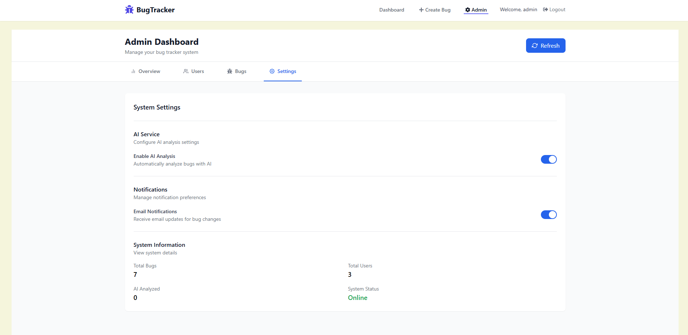
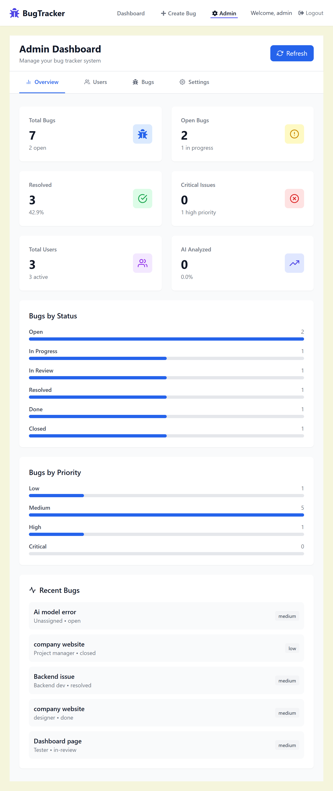
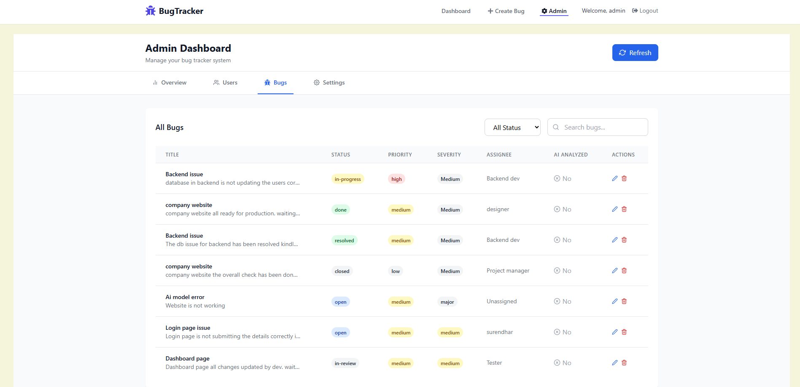
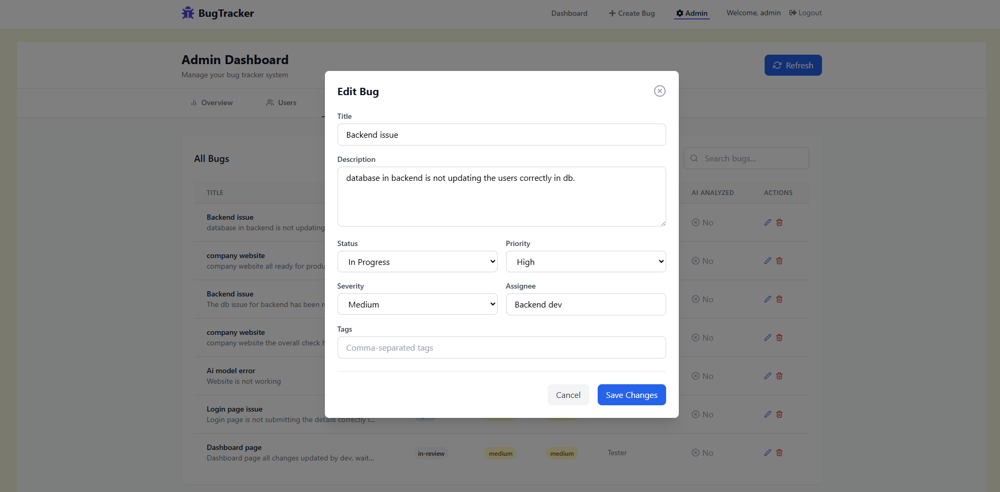

# 🐞 Bug Tracker

[](LICENSE)
[](https://www.oracle.com/java/)
[](https://spring.io/projects/spring-boot)
[](https://reactjs.org/)

A full-stack bug tracking application with AI-powered analysis for efficient issue management. Built with Spring Boot and React, this application helps teams track, prioritize, and resolve bugs effectively.

## ✨ Features

### 🤖 AI-Powered Analysis
- Automatic priority and severity prediction
- Smart bug classification
- Similar issue detection using NLP

### 🐛 Bug Management
- Create, view, update, and delete bugs
- Assign bugs to team members
- Set priority levels (Low, Medium, High)
- Set severity levels (AI-predicted or manual)
- Track status (Open, In-Progress, In-Review, Done, Resolved, Closed)
- AI-powered automatic priority and severity prediction
- AI-generated tags and classification
- Similar bug detection using embeddings
- Due date tracking

### 👥 User Management
- Role-based access control (User, Admin, Manager, Developer, Tester)
- User profiles and preferences
- Secure authentication with JWT
- Default admin and test users auto-created on startup

## 🛠️ Tech Stack

### Backend
- **Java 17**
- **Spring Boot 3.5**
- **Spring Security** with JWT
- **Spring Data JPA**
- **PostgreSQL**
- **DJL (Deep Java Library)** for AI/ML
- **Maven**

### Frontend
- **React 19**
- **React Router**
- **Tailwind CSS**
- **Axios** for API calls
- **@hello-pangea/dnd** for drag-and-drop kanban board

## 🛠️ Prerequisites

- Java 17 or higher
- Node.js 18 or higher
- Maven 3.8 or higher
- npm 9.x or higher
- (Optional) AI Service running on port 8000 for AI features

**Note**: Database configuration is externalized using environment variables. A managed PostgreSQL instance was used during development.

## 🚀 Quick Start

> **📖 For detailed setup instructions, see [STARTUP_GUIDE.md](./STARTUP_GUIDE.md)**

### AI Setup

```bash
# Clone the repository
git clone https://github.com/Pandidurai-22/Bug-Tracker-AI.git
cd bug-tracker-ai
pip install -r requirements.txt

# run to start uvicorn server localhost:8000
python ./main.py
```


### Backend Setup

```bash
# Clone the repository
git clone https://github.com/Pandidurai-22/bug-tracker-backend.git
cd bug-tracker-backend

# Build and run (database is already configured)
mvn spring-boot:run
```

**Note**: The backend automatically creates default users on first startup for local development and demo purposes.

> **🔐 For admin access details, see [ADMIN_LOGIN.md](./ADMIN_LOGIN.md)**

### Frontend Setup

```bash
# frontend cloning 
git clone https://github.com/Pandidurai-22/Bug-Tracker.git

# In a new terminal
cd ../bug-tracker-client
npm install
npm start
```

The application will be available at:
- Frontend: http://localhost:3000
- Backend API: http://localhost:8080/api

## 🔧 Configuration

### 🌱 Environment Variables

**Backend Environment Variables:**
- `DB_URL` - PostgreSQL database connection URL
- `DB_USERNAME` - Database username
- `DB_PASSWORD` - Database password
- `JWT_SECRET` - Secret key for JWT token signing
- `AI_ENABLED` - Enable/disable AI features (true/false)
- `AI_SERVICE_URL` - URL of the AI microservice (default: http://localhost:8000)
- `AI_SERVICE_TIMEOUT` - Timeout for AI service requests in milliseconds (default: 30000)

**Frontend Environment Variables:**
Create `.env` file in the frontend root:
```env
REACT_APP_API_URL=http://localhost:8080/api
```

### Database Configuration
Database configuration is managed through environment variables for security and flexibility.

Configure your database connection using environment variables:
- `DB_URL` - PostgreSQL connection URL
- `DB_USERNAME` - Database username
- `DB_PASSWORD` - Database password

Alternatively, you can update `application.properties` for local development:
```properties
spring.datasource.url=${DB_URL:jdbc:postgresql://localhost:5432/bugtracker}
spring.datasource.username=${DB_USERNAME:postgres}
spring.datasource.password=${DB_PASSWORD:password}
```

### AI Service Configuration
The backend can integrate with an external AI service for enhanced bug analysis.

**Enable AI features** (optional):
```properties
ai.enabled=true
ai.service.url=http://localhost:8000
ai.service.timeout=30000
```

**Disable AI features** (default):
```properties
ai.enabled=false
```

> **Note**: AI endpoints are only available when `ai.enabled=true`. See [bug-tracker-ai](../bug-tracker-ai/) for AI service setup.

### Security Configuration
- **JWT Token Expiration**: 24 hours (86400000ms)
- **CORS**: Configured for `http://localhost:3000` and `https://bugtrackerclient-mu.vercel.app`
- **Authentication**: JWT-based authentication with role-based access control
- **Security**: Security policies can be tightened for production environments without changing business logic

## 📚 API Documentation

### Authentication
- `POST /api/auth/signup` - Register new user
  ```json
  {
    "username": "string",
    "email": "string",
    "password": "string",
    "role": ["admin" | "manager" | "developer" | "tester" | "user"]
  }
  ```
- `POST /api/auth/signin` - User login
  ```json
  {
    "username": "string",
    "password": "string"
  }
  ```
  Returns JWT token and user details including roles.

### Bugs
- `GET /api/bugs` - List all bugs
- `POST /api/bugs` - Create new bug
  ```json
  {
    "title": "string",
    "description": "string",
    "priority": "low" | "medium" | "high",
    "severity": "string (optional, AI-predicted)",
    "status": "open" | "in-progress" | "in-review" | "done" | "resolved" | "closed",
    "assignee": "string",
    "reporter": "string",
    "dueDate": "ISO datetime string",
    "tags": "string (comma-separated, optional, AI-generated)"
  }
  ```
  **Note**: If AI is enabled, priority, severity, and tags are auto-filled if not provided.
- `GET /api/bugs/{id}` - Get bug details
- `PUT /api/bugs/{id}` - Update bug
- `DELETE /api/bugs/{id}` - Delete bug
- `POST /api/bugs/ai/analyze` - Get AI analysis before creating bug
  ```json
  {
    "title": "string",
    "description": "string"
  }
  ```
  Returns: priority, severity, tags, summary, confidence, similar bugs
- `POST /api/bugs/ai/similar` - Find similar bugs
  ```json
  {
    "title": "string",
    "description": "string"
  }
  ```
  Query param: `limit` (default: 5)

### AI Analysis Endpoints
> **Note**: These endpoints require `ai.enabled=true` and AI service running.

**AI Capabilities:**
- Bug priority and severity prediction
- Similar bug detection using embeddings
- Automated tagging and classification
- Optional AI-powered solution suggestions

### Test Endpoints (Role-based Access)
- `GET /api/test/all` - Public access (no authentication required)
- `GET /api/test/user` - Requires: USER, TESTER, DEVELOPER, MANAGER, or ADMIN role
- `GET /api/test/tester` - Requires: TESTER role
- `GET /api/test/developer` - Requires: DEVELOPER role
- `GET /api/test/manager` - Requires: MANAGER role
- `GET /api/test/admin` - Requires: ADMIN role

### User Roles
The system supports 5 roles:
- **ROLE_USER** - Basic user access
- **ROLE_TESTER** - Tester-specific access
- **ROLE_DEVELOPER** - Developer-specific access
- **ROLE_MANAGER** - Manager-level access
- **ROLE_ADMIN** - Full administrative access

## 🔐 Security Notes

This project is intended for learning and demonstration purposes.

- **Sensitive Configuration**: All sensitive values (credentials, JWT secrets, database configuration, AI keys) are externalized using environment variables and are not committed to the repository.
- **Authentication**: Authentication and role-based authorization are implemented using Spring Security and JWT tokens.
- **Production Readiness**: Security rules can be tightened for production environments without impacting core business logic.
- **Best Practices**: The codebase follows security best practices with proper input validation, CORS configuration, and secure password handling.

### Bug Model Fields
- `id` - Auto-generated bug ID
- `title` - Bug title
- `description` - Bug description (max 2000 chars)
- `priority` - Low, Medium, High
- `severity` - AI-predicted or manual severity
- `status` - Current status (open, in-progress, in-review, done, resolved, closed)
- `assignee` - Assigned team member
- `reporter` - Bug reporter
- `dueDate` - Due date (LocalDateTime)
- `createdAt` - Creation timestamp (auto-set)
- `tags` - Comma-separated tags (AI-generated, max 500 chars)
- `aiAnalyzed` - Boolean flag indicating if AI analysis was performed

## 📸 User login Screenshots

| Home Page | Dashboard |
|-----------|-----------|
|  |  |

| Create Bug | AI Analysis |
|------------|-------------|
| .png) | .png) |


## 📸 Admin login Screenshots

| Users | Settings |
|------------|-------------|
|  | |

| Admin overview | Bugs and Edit Bugs |
|-----------|-----------|
|  |   |


## 🤝 Contributing

1. Fork the repository
2. Create your feature branch (`git checkout -b feature/AmazingFeature`)
3. Commit your changes (`git commit -m 'Add some AmazingFeature'`)
4. Push to the branch (`git push origin feature/AmazingFeature`)
5. Open a Pull Request

## 📝 Future Enhancements

- [ ] **Project Management** - Create and manage multiple projects, organize bugs by project
- [ ] Real-time notifications (Socket.io)
- [ ] Email alerts for bug updates
- [ ] Sprint management
- [ ] Advanced reporting and analytics
- [ ] Mobile application
- [ ] Integration with version control (GitHub/GitLab)
- [ ] File attachments for bugs
- [ ] Advanced search and filtering
- [ ] Comments system for bugs
- [ ] Activity tracking and audit logs
- [ ] User profile management endpoints

## 📄 License

This project is licensed under the MIT License - see the [LICENSE](LICENSE) file for details.

## 👤 Author

**Pandidurai S**  
💼 Full-Stack Software Engineer (1.5+ years experience)  
📧 pandidurai32127@gmail.com  
🔗 [LinkedIn](https://in.linkedin.com/in/pandidurai-s-6a30b8212)  

## 📖 Additional Documentation

- **[STARTUP_GUIDE.md](./STARTUP_GUIDE.md)** - Detailed backend setup and troubleshooting
- **[ADMIN_LOGIN.md](./ADMIN_LOGIN.md)** - Admin access and user management guide
- **[HELP.md](./HELP.md)** - Additional help and FAQs

## 🙏 Acknowledgments

- [Spring Boot](https://spring.io/projects/spring-boot)
- [React](https://reactjs.org/)
- [Tailwind CSS](https://tailwindcss.com/)
- [DJL](https://djl.ai/) - Deep Java Library
- [Apache OpenNLP](https://opennlp.apache.org/) - Natural Language Processing